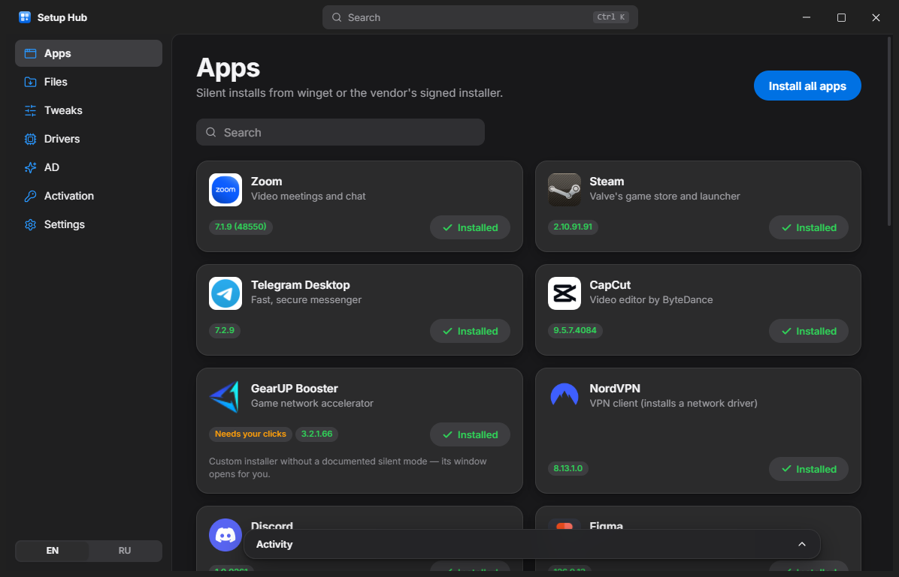

# Setup Hub



**[Download the latest release](https://github.com/sevcenkoa864-oss/setup-hub/releases/latest)**

One-click post-reinstall provisioning for Windows 10/11 x64. After a clean install, download **one file** (`setup-hub.exe`, ~7 MB, portable) and from inside it:

- **Apps** — silent install of 22 apps (winget first, signed vendor installer as fallback), "Install all", multi-select, Ctrl+K palette, live progress, cancel, retry, reboot collection.
- **Files** — list and download the shared Google Drive folder (no sign-in), nested folders, resume. Nothing is run or extracted.
- **Tweaks** — pointer speed (5th notch), Enhance pointer precision off, High performance + never sleep/display-off; optional hibernation / Fast Startup. Each one reverts.
- **Drivers** — latest WHQL Game Ready driver for the detected NVIDIA GPU (NVIDIA App fallback); AMD/Intel get their official pages.
- **AD** — installs your Vencord launcher (bundled in the exe).
- **Activation** — license status, *Open Activation settings*, *Enter my own key*. No KMS, no third-party keys.
- **Settings** — EN/RU, theme, folders, parallel downloads, GitHub token / Google API key (Credential Manager), remote catalog, log export.

## Build

Prerequisites: Node 20+, pnpm, Rust (stable, MSVC), Visual Studio Build Tools with the C++ workload. WebView2 is already on Windows 11.

```bash
pnpm i
pnpm tauri build
```

Outputs:
- `src-tauri/target/release/setup-hub.exe` — the portable single exe (frontend, catalog and AD are embedded; requests admin via manifest).
- `src-tauri/target/release/bundle/nsis/Setup Hub_1.0.0_x64-setup.exe` — optional installer.

Other commands:

| Command | What it does |
|---|---|
| `pnpm dev` | UI only in a browser with mocked backend (`src/devmock.ts`, dev builds only) |
| `pnpm tauri dev` | Real app, **not** elevated (dev manifest is `asInvoker`); run the terminal as admin to test installs/tweaks |
| `pnpm test` | Rust unit tests (catalog, asset regex, Drive parsing, GPU vendor/version, mouse/power logic, exit codes…) |
| `cd src-tauri && cargo test --lib live -- --ignored --nocapture` | Read-only live checks against this PC and the real endpoints |
| `pnpm verify-catalog` | Resolves every catalog link, downloads non-winget installers, checks hash/signature, writes `catalog-report.md` |
| `pnpm icons` | Re-fetches app icons into `public/icons` (build time only; the app makes no icon requests) |

CI: `.github/workflows/build.yml` builds on `windows-latest`, runs the unit tests and uploads both executables. Code signing is not configured — add your certificate via `bundle.windows.certificateThumbprint` or a `signtool` step.

## How installs work

```
resolve (winget → direct URL / vendor page regex / GitHub Releases API)
  → download (HTTPS only, per-item host allow-list incl. redirects, HTTP Range resume, 3 retries with back-off, parallel 1–4)
  → verify (SHA-256 when published — GitHub asset digests — and Authenticode: must be Valid and match the expected publisher;
            unsigned is accepted only when the hash was verified)
  → install (one at a time; MSI via msiexec; ZIPs extracted with zip-slip protection)
  → detect (uninstall registry HKLM/HKLM-WOW/HKCU, MSIX package repository, or a known path)
```

Exit codes 3010/1641 (and winget's "reboot required") collect into one *Restart now* banner. Logs rotate daily in `%LOCALAPPDATA%\SetupHub\logs` (7 days). Downloads live in `%TEMP%\SetupHub\cache` and are deleted after a successful install unless *Keep installers* is on.

### Catalog

`src-tauri/catalog.json` is embedded. Set *Settings → Custom catalog URL* to a raw GitHub URL of your own copy to update links without rebuilding; the last good remote copy is cached and the embedded one is the offline fallback. A remote catalog is validated the same way (https only, URL host must be in that item's `allowed_hosts`).

Schema per item: `id, name, category, description{en,ru}, winget_id?, source{type: winget|direct|github_release|scrape, url|repo+asset_regex|page+regex}, silent_args[], detect{display_name?, path?, appx?}, allowed_hosts[], publisher?, zip?{run|extract_to+shortcut+launch}, needs_reboot, interactive, unelevated, note?`.

See **[catalog-report.md](catalog-report.md)** for the verified URL, version, installer type, signer and silent switches of every item.

## Decisions (and deviations from the brief)

- **Signature check** uses `Get-AuthenticodeSignature` (a WinVerifyTrust wrapper) instead of raw WinVerifyTrust FFI — same trust decision, also returns the signer name, ~40 lines less unsafe code.
- **GPU detection** and **license status** read WMI through PowerShell `Get-CimInstance … | ConvertTo-Json` instead of the `wmi` crate. License status comes from `SoftwareLicensingProduct` (what `slmgr /dli /xpr` read) so it is locale-independent; the product key itself still goes through `slmgr /ipk` + `/ato`.
- **Registry** via `winreg`, `SystemParametersInfo` via `windows-sys`, Mica via Tauri's built-in `windowEffects` (no `window-vibrancy` crate needed). Windows 10 gets a solid background.
- **Spotify** (refuses elevated installs) runs through a one-shot scheduled task with `/RL LIMITED` as the signed-in user; Setup Hub waits for its exit code and deletes the task.
- **Winget download progress** is parsed from winget's own "x MB / y MB" output.
- **Filled-button blue** is `#0071E3` in both themes: white text on `#007AFF`/`#0A84FF` is only 4.0/3.6 : 1, below the required 4.5 : 1. `#0A84FF`-family blues are still used for links and icons in dark mode. The Windows accent color is not applied for the same reason (arbitrary accents break contrast).
- **GIGABYTE Control Center**: gigabyte.com's lookup API is behind bot protection, so the catalog pins the current `GCC_26.09.10.01.zip` on `download.gigabyte.com`; update it via the remote catalog. Its setup has no documented silent switch, so it opens for you (*Needs your clicks*). ~900 MB.
- **GearUP Booster** ships a custom 7-Zip SFX installer with no documented silent switch — *Needs your clicks*.
- **Astrum Play** is a web loader (`astrum-play.ru/loader/AstrumPlayLoader.exe`) with no silent mode — also *Needs your clicks*.
- **PDFCraft** (`storytold/pdfcraft`) is a real desktop app with a signed Windows MSI and published SHA-256s, so it installs like the others.
- **AutoLogon** is extracted to `%ProgramFiles%\SetupHub\Tools\Autologon` with a Start Menu shortcut and launched; Setup Hub never types credentials.
- **NVIDIA**: product/series IDs come from `lookupValueSearch.aspx` (TypeID 3/4) matched against the WMI GPU name, then `AjaxDriverService DriverManualLookup` with `dch=1, isWHQL=1, upCRD=0` (Game Ready, not Studio). Installed with `-s -noreboot -noeula [-clean]`; a reboot is always offered after.
- **Icons** are fetched once at build time (`pnpm icons`) and bundled, so runtime network calls stay limited to catalog, downloads, NVIDIA lookup and Drive. No telemetry, no updater.

## AD (from `F:\AD`)

`src-tauri/resources/AD/` is a copy of `F:\AD` (without `bin/` and `obj/` build output). It contains:

- `VencordLauncher/` — the C# .NET 8 WinForms app **MyDiscordLauncher** (`Program.cs`, `Ui.cs`) and its build `out/MyDiscordLauncher.exe`. **This is what Setup Hub installs.** It is framework-dependent → needs the **.NET 8 Desktop Runtime** (installed automatically via winget `Microsoft.DotNet.DesktopRuntime.8`). At runtime it downloads `VencordInstallerCli.exe` from `github.com/Vencord/Installer` into `%LOCALAPPDATA%\MyDiscordLauncher`, patches Discord's `app-*` folder when `_app.asar` is missing, then starts Discord via `Update.exe --processStart Discord.exe`; `--silent` mode is what it registers to run at sign-in.
- `Launcher/` — an older Go variant (`main.go`, needs `config.json` + `VencordInstallerCLI.exe` beside it). Source only, no binary; kept for reference, not installed.

*Install AD* writes `%LOCALAPPDATA%\Programs\AD\MyDiscordLauncher.exe`, pre-fills its Discord path and Vencord CLI (hash-verified against GitHub's digest) so its first two steps are already green, adds Desktop and Start Menu "AD" shortcuts and opens it — click **Enable** there to start with Windows. If Discord is missing, the AD page offers "Install Discord, then AD".

"Replace Discord shortcut" is intentionally **not** offered: in `--silent` mode the launcher does nothing when Discord is already patched (Program.cs line 30), so a Discord shortcut pointing at it would stop opening Discord.

To update AD, rebuild it in `F:\AD\VencordLauncher` (`dotnet publish -c Release -o out`), copy `out\MyDiscordLauncher.exe` into `src-tauri/resources/AD/VencordLauncher/out/` and rebuild Setup Hub.

## Layout

```
src/                     React UI (App shell, pages/, components.tsx, api.ts job store, i18n/en.json + ru.json)
src-tauri/src/
  lib.rs                 Tauri commands + setup
  engine.rs              job pipeline, queues, events
  catalog.rs             schema, remote override, GitHub/scrape resolution
  download.rs  sig.rs    resumable downloads, SHA-256 + Authenticode policy
  installer.rs           winget, installers, de-elevation, unzip
  detect.rs              installed-state detection
  tweaks.rs gpu.rs drive.rs ad.rs activation.rs settings.rs util.rs
  bin/verify_catalog.rs  build-time link verification → catalog-report.md
QA-CHECKLIST.md          manual test plan for a clean Windows 11 VM
```
